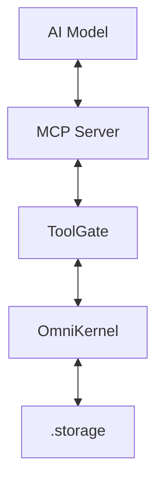

# Model Context Protocol (MCP)

A rụrụ OmniPaw na **Model Context Protocol (MCP)**—ọkọlọtọ mepere emepe nke na-enye ohere ka onye ọrụ AI soro data na ngwa ọrụ mpụga kpaa n'ụzọ a haziri ahazi.

Na nhazi OmniPaw, mcp server na-arụ ọrụ dị ka **Interface Mpụga** nke [ToolGate](/ig/concepts/tool-permissions).

## ::code-preview

## class: "[&>div]:\*:my-0"

:omni-telemetry-preview

#code

```mdc
:omni-telemetry-preview
```

::

## MCP Server nke Obodo (Local MCP Server)

Site na ndabara, ọ bụla ihe nchịkwa OmniPaw na-amalite na mcp server nke obodo. Server a na-egosi atụmatụ atọ dị isi na AI model:

1.  **Resources**: Na-enye ikike ọgụgụ (read-only) n'ọrụ ndekọ ọnọdụ, ebe nchekwa ncheta, na Iwu Isi 15.
2.  **Ngwa Ọrụ (Tools)**: Ihe mkpuchi nchekwa maka iwu shell, faịlụ sistemụ, na ndị ahịa API.
3.  **Prompts**: Templates akọwapụtara maka ọrụ kernel dị mgbagwoju anya (dịka "Nyochaa trace divergence a").

## Nhazi MCP (MCP Architecture)



### Gịnị kpatara MCP?

Tupu MCP, ndị mmepe ga-ederịrị "glue code" maka ọ bụla ngwa ọrụ ọhụrụ onye ọrụ chọrọ. Site na mmekọrịta MCP nke OmniPaw:

- **Ngwa Ọrụ Zero-Config**: Itinye ngwa ọrụ ọhụrụ dị mfe dịka ịdebanye aha handler na `ToolRegistry`.
- **Interop**: Onye ọrụ ọ bụla kwekọrọ na MCP (gụnyere [Onye Inyeaka AI](/ig/ai/assistant) agbakwunyere) nwere ike ịghọta ozugbo otu esi emekọrịta ihe na ihe nchịkwa OmniPaw.
- **Strict Typing**: MCP na-ahụ na ozi si na model gaa na kernel bụ nke a nwapụtara nke ọma tupu ọ rute n'ọkwa ọrụ.

## Ijikọ Server Mpụga

Ị nwere ike ijikọ ihe nchịkwa OmniPaw gị na mcp servers mpụga iji gbasaa ike ya:

```ts [nuxt.config.ts]
export default defineNuxtConfig({
  assistant: {
    // Rụtụ aka na mcp server dị anya (dịka GitHub, Slack, ma ọ bụ Google Drive)
    mcpServer: "https://mcp.omnipaw.io/v1/plugins/github",
  },
});
```

## Imepụta Ngwa Ọrụ Pụrụ Iche

Iji gosi ọrụ pụrụ iche na onye ọrụ site na MCP, ị ga-akọwa atụmatụ ya na handler:

```typescript
// Kọwaa handler maka ngwa ọrụ pụrụ iche
const myTool = {
  name: "get_kernel_health",
  description: "Na-eweghachi ọnọdụ invariants nke kernel",
  handler: async (args) => {
    return kernel.checkAllInvariants();
  },
};

// Debanye aha site na ToolGate
kernel.gate.register(myTool);
```

Ozugbo emere nke a, mcp server ga-agụnye `get_kernel_health` ozugbo na arịrịọ tool-discovery nke na-esote site na AI.

Na-esote: Nyochaa [Nhazi LLM Adapter](/ig/ai/llms).
